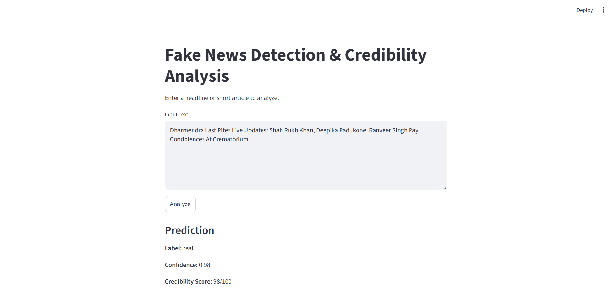

# 📰 Fake News Detection & Credibility Analyzer

<p align="center">
  
</p>

A lightweight ML project that identifies whether a news headline/article is **Fake** or **Real** using **SBERT embeddings**, **Logistic Regression**, **LIME explainability**, and a clean **Streamlit web app**.

Built as part of the **GroundTruth AI Internship/Fellowship** application.

---

# 🚀 Features

* **SBERT (all-MiniLM-L6-v2)** for 384-dimensional sentence embeddings
* **Logistic Regression classifier** (~96% accuracy)
* **Credibility score (0–100)**
* **LIME explainability** with highlighted influential words
* **Streamlit UI** for instant predictions
* **Reproducible training notebook**

---

# 🖥️ Streamlit App Preview

<p align="center">
  
</p>

---

# 📂 Project Structure

```
fake-news-detector/
├── models/
│   ├── classifier.joblib
│   └── sbert_model/        # optional local SBERT model
├── src/
│   └── app_streamlit.py
├── notebooks/
│   └── training_pipeline.ipynb
├── LIME Results.png
├── analysis.png
├── README.md
└── requirements.txt
```

---

# ⚙️ Setup

### **1. Create Virtual Environment**

**Windows**

```
python -m venv venv
venv\Scripts\activate
```

**Mac/Linux**

```
python3 -m venv venv
source venv/bin/activate
```

### **2. Install dependencies**

```
pip install -r requirements.txt
```

### **3. Add model**

Place model file here:

```
models/classifier.joblib
```

(Optional SBERT model: `models/sbert_model/`, otherwise it auto-downloads.)

### **4. Run the Streamlit App**

```
streamlit run src/app_streamlit.py
```

---

# 📊 Evaluation Summary

* **Accuracy:** ~96%
* **Precision/Recall/F1:** 95–97%

### **Confusion Matrix & Metrics**

<p align="center">
  
</p>

---

# 🟩 LIME Explainability Example

<p align="center">
  
</p>

---

# 🧠 Technical Flow

1. Text preprocessing
2. SBERT embedding generation (384-dim)
3. Logistic Regression classification
4. LIMETextExplainer interpretability
5. Streamlit frontend

---

# 🗂 Dataset

**ISOT Fake/Real News Dataset**
[https://www.kaggle.com/datasets/thought19/fake-news-detector](https://www.kaggle.com/datasets/thought19/fake-news-detector)

---

# 📜 License

MIT License

---

# 🙋 Author

**Aryan Singh**
